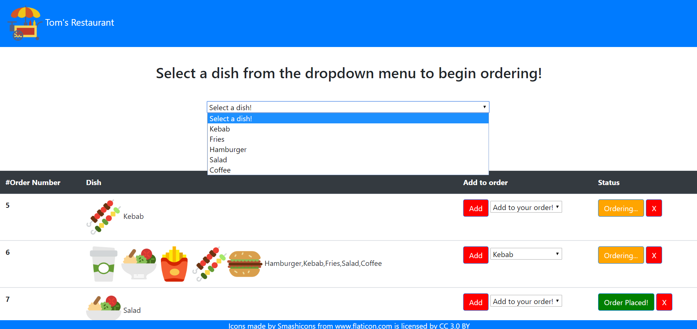

# Tom's Online Restaurant!

## Description

An application deployed on heroku at https://tranquil-sands-68529.herokuapp.com/ that simulates a system for managing online orders. The user can select a dish from a dropdown menu (used to simulate a restaurant menu). They can add to the order by hitting the "Add" button. And they can complete their order by hitting the button that says "Ordering...". They can also choose to have their order completed after their first item is added (if they are only ordering one item). Used to showcase proficiency in mySQL

## Image of the site

## Technologies Used
   
   * MySql
   * Node.js
   * Javascript
   * Express
   * Bootstrap
   * CSS
   * HTML
   
The main purpose of this project is to show proficiency in using RESTful APIs, CRUD operations, and using MVC framework.

Working on rebuilding using React with Redux
   
  
   
